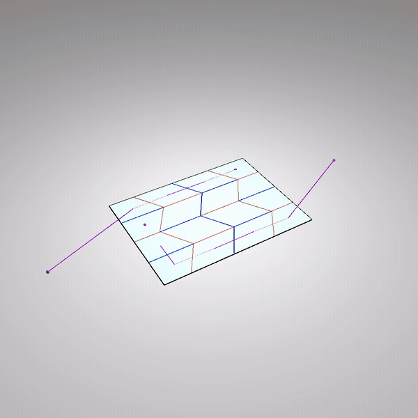
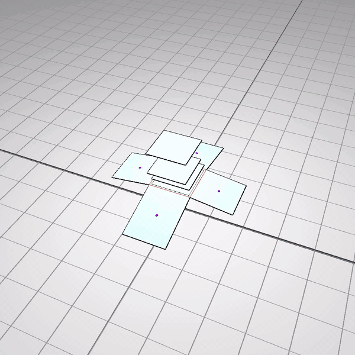
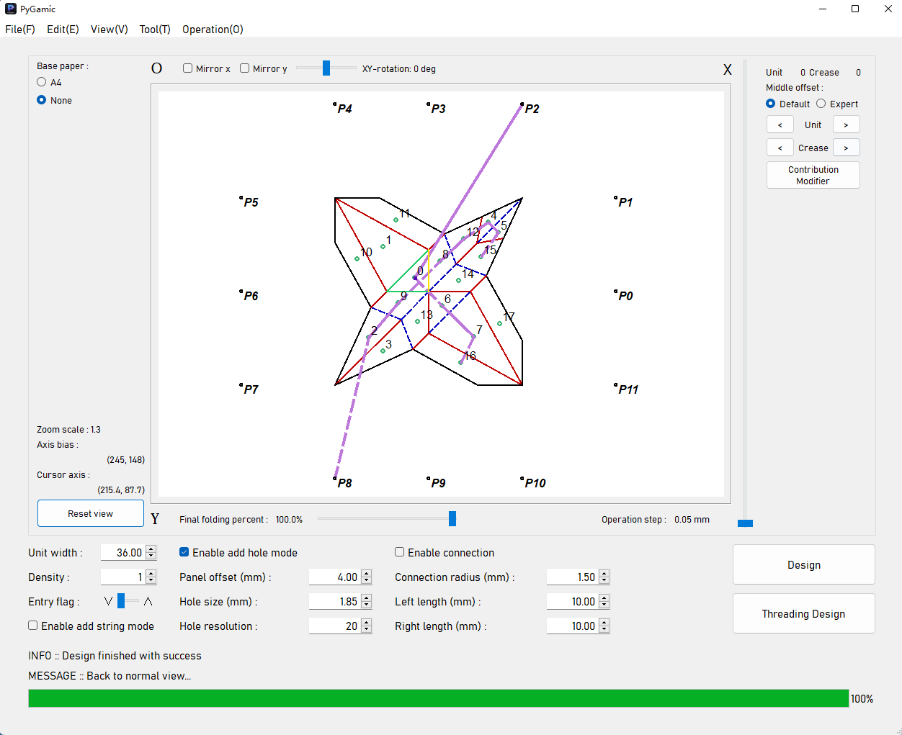
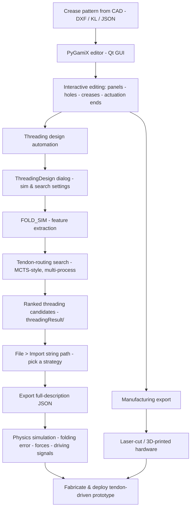
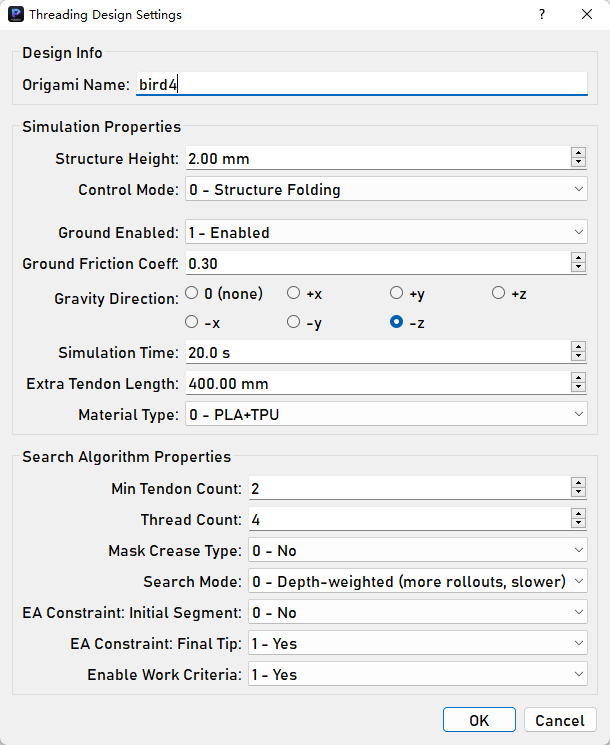
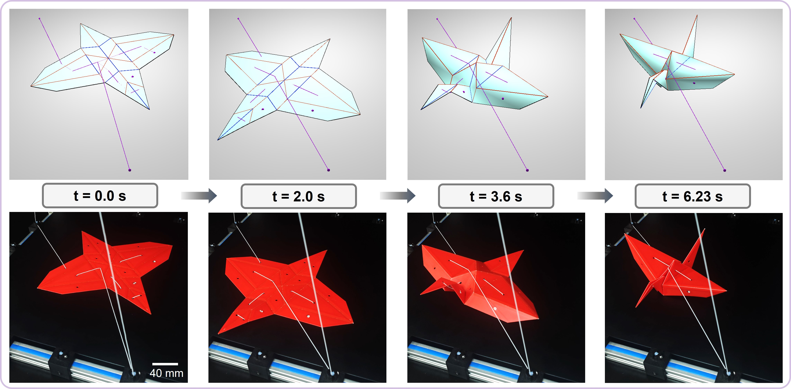

# PyGamiX

**An integrated CAD / CAM / simulation workbench for engineering origami — with automated tendon-threading design for tendon-driven origami structures and robots.**

[](https://www.python.org/) []() []() []() [](LICENSE) [](CHANGELOG.md)

**English** | [Chinese](README.zh-CN.md)

📦 This is the open-source release accompanying the paper [*Design and Fabrication of String-driven Origami Robots* (ICRA 2024)](https://arxiv.org/abs/2404.09222).

<p align="center">
  
  &nbsp;&nbsp;
  
</p>

<p align="center"><em>Tendon-driven folding simulated in the built-in Taichi simulator — the tendon (string) routing, the folding motion and the live tension / tendon-length readout are all produced by PyGamiX, no hardware required.</em></p>

---

## Why PyGamiX?

Most origami software stops at geometry. PyGamiX is built for **engineering deployment**: crease patterns drawn in commercial CAD can be imported, edited with engineering intent (holes, hinge lines, thick panels), exported directly to fabrication files (laser cutting / 3D printing), and — its key differentiator — **automatically planned for tendon-driven actuation** and validated in a built-in physics simulator *before* hardware exists.

Highlights:

- **Design** — import crease-pattern DXF files (from commercial CAD) or parametric kinematic-line (KL) modules; parse them into panels and creases; edit crease attributes interactively (folding-angle bounds, hard creases, folding priority level/coeff, recovery levels), drill holes into panels, set thick-panel heights, add/fix panels, mirror & rotate.
- **CAM / fabrication** — one-click export of layered **DXF** drawings for laser cutting, **Split-DXF** with panel offsets & hinge features for hinged thick panels, and **STL** models of panels/creases/holes/tendon channels for 3D printing.
- **Physics simulation** — a self-developed, Taichi-based deformable-body origami simulator (in-plane stretching, crease & facet bending, **tendon actuation through holes with friction**, ground contact, collision/self-intersection avoidance, optional thick panels; implicit time stepping with energy-based line search; interactive GGUI 3D view).
- **Automated threading design** — specify holes + actuation ends on your crease pattern, configure the simulation & search settings, and PyGamiX searches for tendon-routing (threading) strategies that fold the structure to the target configuration, returning ranked candidates with predicted performance.
- **Sim-to-real loop** — record experiment data from the physical prototype and overlay it with simulation (displacement / force vs. time) for calibration and validation.

---

## Installation

- **OS:** Windows (primary test platform). Python 3.9 is required (older Taichi/PyQt5 stack; NumPy ≤ 1.26).
- Dependencies: `taichi` (CPU), `PyQt5`, `numpy`, `matplotlib`, `scipy`, `dxfgrabber`, `ezdxf`, `cmaes`, `pandas`.

Recommended (Conda):

```bash
git clone https://github.com/Sepkimmy-YPW/PyGamix-V3.0-release.git
cd PyGamix-V3.0-release
conda env create -f environment.yml     # creates env "pygamic"
conda activate pygamic
python main.py
```

Alternative (existing environment): `pip install -r requirement.txt` — **not** guaranteed to work on newer NumPy/Python unless pinned to Python 3.9 + NumPy ≤ 1.26.

> The GUI is launched from the repository root (relative paths such as `./setting/` are used internally).

---

## Quick start

1. Launch the app: `python main.py`
2. Try a bundled example: **File ▸ Open file...** and choose a packed-data design file, e.g. `packedImport/miura-120.json` (any `packedImport/*.json` works; note that files in `descriptionData/` are simulator system-description files and cannot be opened here), then press the **Design** button.
3. Or bring your own crease pattern: **File ▸ Import dxf** → click **Design** once the preview is loaded.
4. **Save your design and resume later:** once you are happy with a design, use **File ▸ Save result...** (or press **Ctrl+S**) to pack the *entire* current design — all origami modules, unit biases, hole/crease settings, tendon routing, connection candidates, crease angles — into a single packed-data JSON file. Reload it anytime with **File ▸ Open file...** to continue right where you left off, instead of re-importing a DXF/KL file and repeating every edit. Tip: store your own designs in `packedImport/` next to the bundled examples to keep them organized.

> **Save & resume workflow**
>
> `File ▸ Save result...` / `Ctrl+S` → packed-data JSON (`packedImport/your-design.json`) → `File ▸ Open file...` → continue editing. Designs opened from a file are saved back to the same file silently.

**Figure 1 — Main interface.**

<p align="center">
  
</p>

<p align="center"><em>The main window: the crease pattern (with holes and creases drawn) in the central canvas, the parameter panel on the right (unit width, density, hole mode, panel offset), and the <b>Design</b> / <b>Threading Design</b> actions in the bottom-right corner.</em></p>

---

## Architecture overview



| Module | Responsibility |
| --- | --- |
| `main.py`, `logic.py` | App entry & main window — all interactive workflows |
| `gui/` (`window.ui`, `Ui_*.py`) | Qt user interface definition |
| `utils.py`, `units.py` | Core data model: `Vertex`/`Crease` geometry, origami units (Miura, Lean-Miura), crease-pattern graph & unit parsers |
| `desc.py`, `designer.py` | Design-description representation & construction |
| `dxftool.py`, `stltool2.py` | DXF / Split-DXF / STL output for manufacturing |
| `phys_sim25.py`, `ori_sim_sys.py`, `spatialhash.py` | Self-developed Taichi physics simulator (with a spatial-hash index for fast key-point lookup) |
| `trainer.py`, `threading_design_dialog.py` | Tendon-threading strategy search & its settings dialog |
| `cdftool.py` | Computational-design utilities (transition-angle/curve fitting, evolutionary & tree search helpers) |
| `plotkit.py`, `tm_window.py`, `pref_pack.py` | Plotting, visualization and preference windows |

---

## Workflow A — Crease-pattern design & fabrication (CAD → CAM)

1. **Import** — **File ▸ Import dxf** selects a DXF crease pattern (or **Import_KL...** for parametric line-based modules; **File ▸ Open file...** for a packed design JSON). After import, click **Design** to parse the pattern into panels & creases.
2. **Edit panels & creases:**
   - *Holes* — tick **Enable add hole mode**, then click inside a panel to add a tendon/pass-through hole; **Hole size / Hole resolution** control its geometry; **Edit ▸ Add Holes...** batch-adds center holes to all panels.
   - *Creases* — **Edit ▸ Edit Creases...** browses each crease to set its **Level/Coeff** (folding priority in the sequence), angle bounds, hard (non-folding) status, and recovery level/angle; double-click a crease toggles it hard. **Tool ▸ Calculate Sequence** derives the fold sequence automatically.
   - *Panels* — **Edit ▸ Edit Panels...** fine-tunes panel offset & holes per panel; **Edit ▸ Fix Panel...** locks a panel during simulation.
   - *Actuation ends* — **Edit ▸ Add / Delete / Select Actuation Ends** places the anchor candidates where external actuators will pull (needed for Workflow B).
   - Mouse/keyboard: wheel zooms, arrows nudge the selection, `Q`/`E` rotate a module, `Ctrl+Z` undoes the last hole, `Ctrl+E` exports all STL.
3. **Export for manufacturing** — **File ▸ Export ▸ As Dxf...** (layered line drawing for laser cutting), **As Split Dxf...** (offset panels + hinge features for hinged thick panels), **All As Stl...** (3D-printable panels/features).

---

## Workflow B — Tendon-driven origami: build + automated threading design (core feature)

> The goal: given a crease pattern that should fold into a 3D configuration, find **which panels the tendons should pass through, in what order** (and where actuators attach) so that pulling the tendons folds the structure correctly — then verify it in simulation and deploy it on a real prototype.

1. **Prepare the crease pattern** (same as Workflow A): **File ▸ Import dxf** → **Design**.
2. **Add through-holes and actuation ends** on the panels — the routing search routes tendons through panel holes and anchors them at actuation ends.
3. **Press the `Threading Design` button** (right-hand panel). In the dialog, name the design (`Origami Name`) and configure the simulation & search parameters (see the table below), then confirm.
4. PyGamiX runs the search automatically (progress is shown in the message area; use **Operation ▸ Stop Thread...** to abort):
   - it exports the current design to `descriptionData/<name>.json`,
   - runs **FOLD_SIM** (a first physics pass that extracts system features for the search),
   - then launches the **tendon-routing search** (`trainer.py`, MCTS-style with multi-process rollouts), writing ranked candidate strategies into `threadingResult/`.
5. **Load a strategy back into the editor** — **File ▸ Import string path**, choose the result JSON. PyGamiX lists the ranked candidates and lets you set your speed-vs-force preference; the chosen tendon routing is then drawn over the crease pattern.
6. **Export the complete system description** — **File ▸ Export ▸ As Full-description Data...** produces the JSON (panels, creases, features, strings, actuation ends, …) that drives the detailed simulator.
7. **Evaluate in simulation** — **Tool ▸ Physical Simulation...** runs the built-in simulator on the current design (interactive GGUI view). Track the achieved folding percentage/error, actuation force and the driving signals (tendon length reduction vs. time).
8. **Manufacture & deploy** — export the drawings/models (DXF / STL), fabricate the structure, install the tendons following the planned strategy, and run the physical prototype. Use **Tool ▸ Plot Physical Data** (or Plot Simulation Data / Plot Evolution Data) to compare recorded experiment data with simulation for calibration.

**Figure 2 — Threading Design settings dialog.**

<p align="center">
  
</p>

<p align="center"><em>The <b>Threading Design Settings</b> dialog — design info (origami name), simulation properties (structure height, control mode, ground/friction/gravity, simulation time, extra tendon length, material type) and search-algorithm properties (min tendon count, thread count, mask crease type, search mode, EA constraints, work criteria). Every field is documented in the table below; the settings are saved per origami name and pre-filled on the next run.</em></p>

### Threading Design dialog — parameters

Simulation properties:

| Parameter | Meaning | Default |
| --- | --- | --- |
| **Origami Name** (A) | Name of the design; used for `descriptionData/<name>.json` and the result folder. | — |
| **Structure Height (mm)** (C) | Initial height at which the folded structure is placed/supported in simulation. | 1.00 |
| **Control Mode** (D) | `0 – Structure Folding`: fold the whole structure to its target crease angles; `1 – Robot Actuation`: drive an end-effector/robot output (reveals controller fields below). | 0 |
| Controller Type (L) | *(only when D = 1)* Hardware controller type used in the robot-actuation evaluation. | 1 |
| Actuator Stroke Percent (S) | *(only when D = 1)* Usable actuator stroke as a fraction of its full range (0.00–1.00). | 0.75 |
| **Ground Enabled** (E) | Enable/disable ground collision during simulation. | 0 (disabled) |
| Ground Friction Coeff. (K) | *(only when E = 1)* Coulomb friction coefficient between the structure and the ground. | 0.30 |
| **Gravity Direction** (F) | Gravity applied during evaluation: none / ±x / ±y / ±z. | 0 (none) |
| **Simulation Time (s)** (G) | Max. duration of one simulated (evaluation) run. | 20.0 |
| **Extra Tendon Length (mm)** (I) | Extra slack added to every tendon (e.g., compensation for routing fixtures / real actuators). | 0.00 |
| **Material Type** (J) | `0 – PLA+TPU` or `1 – PU foam+TPU` (affects density/mass properties). | 0 |

Search-algorithm properties:

| Parameter | Meaning | Default |
| --- | --- | --- |
| **Min Tendon Count** (B) | Minimum number of tendons to search for (the search seeks solutions with as few tendons as possible from this number upward). | 1 |
| **Thread Count** (H) | Number of parallel processes for the search (1–16). | 4 |
| **Mask Crease Type** (N) | If on, mountain/valley labels are ignored during the search (searches over symmetric crease patterns more freely). | 0 (no) |
| **Search Mode** (M) | `0 – Depth-weighted`: rollouts scale with remaining depth (more rollouts, slower, more thorough); `1 – Uniform`: fixed rollout count (faster). | 0 |
| **EA Constraint: Initial Segment** (O) | Require the routing to start from an externally-actuated segment (EA) — i.e., the tendon is pulled by an actuator at its start. | 1 (yes) |
| **EA Constraint: Final Tip** (P) | Require the routing to end at an externally-actuated tip. | 1 (yes) |
| **Enable Work Criteria** (Q) | Include work/energy criteria in the reward evaluation (penalizes inefficient actuation). | 1 (yes) |

> The search objective balances folding accuracy/achieved final configuration, tendon count and actuation effort/force — the reward coefficients are configurable in `trainer.py`.

---

## Simulation & data formats

**Packed-data JSON** (design save files — write with **File ▸ Save result...** / `Ctrl+S`, read back with **File ▸ Open file...**): the complete, resumable state of a design — every origami module (with its source type: KL / DXF / lean-Miura), unit bias list, hole axis & hole settings, panel connections, all crease `line_features`, tendon routing (`strings`), actuation-end candidates (`P_candidators`), fixed panels and crease angles. Reopening such a file restores the design exactly where you left it, so iterative design sessions never have to start over from a DXF/KL import.

The **system description JSON** (exported via *As Full-description Data...*, consumed by the simulator and the threading search) contains:

| Field | Meaning |
| --- | --- |
| `kps`, `lines`, `units` | Key-points, crease segments, panel polygons |
| `line_features` | Per-crease: type (mountain/valley/...), level & coeff (fold sequence), recovery level/angle, hard status & angle bounds, thick-panel height |
| `strings` | Tendon routing: per tendon a sequence of `type` (A/B anchor/pass-through), `id` (point index) and `reverse` (direction) entries |
| `P_candidators` | Actuation-end candidates: anchor points and their host-panel connection indices |
| `contributions`, `fix`, `crease_angle`, `crease_info` | Folding contributions, fixed panels, target crease angles & extra metadata |

Key directories (relative to the repo root):

| Path | Content |
| --- | --- |
| `descriptionData/` | System-description JSONs (working files & bundled examples) |
| `importFile/`, `packedImport/` | KL-module import samples / packed-data design files — bundled examples (Miura, waterbomb, robot arms, boxes…) **and where your own `Save result...` designs can live** |
| `threadingResult/` | Threading-search output (created at run time): ranked candidates, training curves (PNG/CSV) |
| `dxfResult/`, `stlResult/` | Export outputs |
| `experiment/` | Recorded experiment data (CSV/TRK) used for sim-to-real plotting |
| `curve/` | Example 3D trajectory/curve samples for the View menu |
| `docs/images/` | Screenshots, comparison figures and demo GIFs used by this README |

**Figure 3 — Sim-to-real verification: simulation vs. physical prototype.**

<p align="center">
  
</p>

<p align="center"><em>The same tendon-driven fold at <b>t = 0.0 / 2.0 / 3.6 / 6.23 s</b> — simulated in PyGamiX (top row) and performed by the physical prototype actuated through the planned tendon routing (bottom row). Full clips: <a href="docs/images/video1.mp4">video1.mp4</a> (simulation), <a href="docs/images/video2.mp4">video2.mp4</a> (actuator folding on the ground).</em></p>

---

## Citation

If you use PyGamiX in your research, please cite our work:

> **Design and Fabrication of String-driven Origami Robots**
> Peiwen Yang, Shuguang Li — *IEEE International Conference on Robotics and Automation (ICRA), 2024*
> [arXiv:2404.09222](https://arxiv.org/abs/2404.09222) · [DOI: 10.1109/ICRA57147.2024.10610989](https://doi.org/10.1109/ICRA57147.2024.10610989)

```bibtex
@inproceedings{yang2024design,
  title     = {Design and Fabrication of String-driven Origami Robots},
  author    = {Yang, Peiwen and Li, Shuguang},
  booktitle = {2024 IEEE International Conference on Robotics and Automation (ICRA)},
  year      = {2024},
  doi       = {10.1109/ICRA57147.2024.10610989}
}
```

---

## License

Distributed under the **MIT License**. See [LICENSE](LICENSE) for details.

---

## Changelog

See [CHANGELOG.md](CHANGELOG.md) for the full version history (current release: **v3.0.2** — missing `spatialhash.py` module added, curated description-data examples with new Miura-EA designs, and an updated PyInstaller packaging configuration; v3.0.1 added threading-design presets, live threading-search progress bar, and a ~340× faster STL export).
