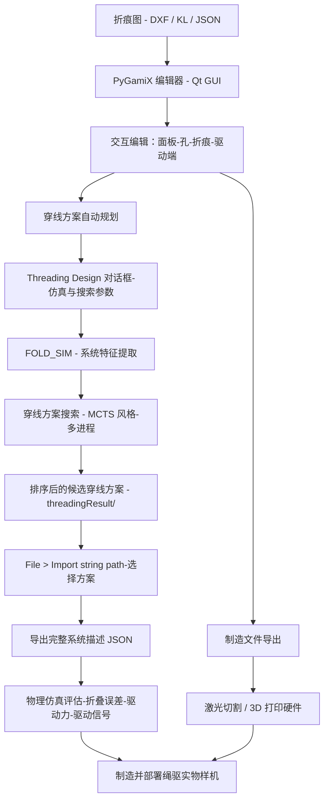

# PyGamiX

**面向工程折纸的一体化 CAD / CAM / 仿真软件平台 —— 并支持绳驱折纸结构与机器人的腱绳穿线（Threading）方案自动规划。**

[](https://www.python.org/) []() []() []() [](LICENSE) [](CHANGELOG.md)

[English](README.md) | **简体中文**

📦 本仓库是论文 [*Design and Fabrication of String-driven Origami Robots*（ICRA 2024）](https://arxiv.org/abs/2404.09222) 的配套开源软件。

---

## 为什么选择 PyGamiX？

多数折纸软件止步于几何层面，而 PyGamiX 面向**工程落地**：支持导入商业 CAD 绘制的折痕图，按工程需求编辑（打孔、铰链线、厚板等），一键导出可用于制造的图纸/模型（激光切割、3D 打印）；其核心特色是能够**自动规划绳驱折纸系统的穿线/驱动方案**，并在自研物理仿真器中预先验证，再投入实物制造。

主要特性：

- **设计（CAD）** —— 导入折痕图 DXF 文件（来自商业 CAD）或参数化运动学线段（KL）模块；解析为面板与折痕后，可交互编辑折痕属性（折叠角度上下界、硬折痕、折叠序列 level/coeff、恢复层级）、在面板上打孔、设置厚板高度、固定面板、镜像与旋转等。
- **制造（CAM）** —— 一键导出分层 **DXF** 线稿用于激光切割、带面板偏距与铰链特征的 **Split-DXF**（铰链式厚板折纸）、以及可 3D 打印的面板/折痕/孔/绳道 **STL** 模型。
- **物理仿真** —— 自研、基于 Taichi 的可变形折纸仿真器（面内拉伸、折痕与面片弯曲、**腱绳过孔驱动与摩擦**、地面接触、碰撞/自穿透规避、可选厚板；隐式时间积分 + 基于能量的线搜索；GGUI 三维交互视图）。
- **穿线方案自动规划** —— 在折痕图上布置穿线孔与驱动端后，配置仿真与搜索参数，PyGamiX 即自动搜索能将结构折叠到目标构型的腱绳穿线策略，并按预测性能返回排序后的候选方案。
- **仿真-实物闭环（sim-to-real）** —— 将实物样机的实验数据（位移/力-时间）与仿真曲线叠加对比，用于标定与验证。

---

## 安装

- **操作系统：** Windows（主要测试平台）。需要 **Python 3.9**（依赖较旧的 Taichi/PyQt5 技术栈，NumPy 需 ≤ 1.26）。
- 依赖：`taichi`（CPU）、`PyQt5`、`numpy`、`matplotlib`、`scipy`、`dxfgrabber`、`ezdxf`、`cmaes`、`pandas`。

推荐方式（Conda）：

```bash
git clone https://github.com/Sepkimmy-YPW/PyGamix-V3.0-release.git
cd PyGamix-V3.0-release
conda env create -f environment.yml     # 创建环境 "pygamic"
conda activate pygamic
python main.py
```

备用方式（已有环境）：`pip install -r requirement.txt` —— 若非 Python 3.9 + NumPy ≤ 1.26，不保证可运行。

> 请在仓库根目录启动 GUI（程序内部使用 `./setting/` 等相对路径）。

---

## 快速开始

1. 启动软件：`python main.py`
2. 试用内置示例：**File ▸ Open file...** 选择如 `packedImport/miura-120.json`（或任意 `descriptionData/*.json`），然后点击 **Design** 按钮。
3. 或导入自己的折痕图：**File ▸ Import dxf** → 预览加载完成后点击 **Design**。

> **图片占位 1 —— 软件主界面与编辑示例**
>
> <!-- FIGURE-1: 请替换为 docs/images/gui_overview.png -->
>
> **图片作用：** 让读者第一眼看到 PyGamiX 的界面布局 —— 中央绘图区的折痕图、右侧含 **Design / Threading Design** 按钮的参数面板，以及某个真实设计（例如带孔的 Waterbomb/Miura 面板）处于编辑/选中状态的示例。建议用带批注的截图。
>
> 建议路径：`docs/images/gui_overview.png`（宽度约 1280 px）。

---

## 架构总览



| 模块 | 职责 |
| --- | --- |
| `main.py`、`logic.py` | 程序入口与主窗口 —— 全部交互工作流 |
| `gui/`（`window.ui`、`Ui_*.py`） | Qt 用户界面定义 |
| `utils.py`、`units.py` | 核心数据模型：`Vertex`/`Crease` 几何、折纸单元（Miura、Lean-Miura）、折痕图树状结构与单元解析器 |
| `desc.py`、`designer.py` | 设计描述（description）的表示与构建 |
| `dxftool.py`、`stltool2.py` | 面向制造的 DXF / Split-DXF / STL 输出 |
| `phys_sim25.py`、`ori_sim_sys.py` | 自研 Taichi 物理仿真器 |
| `trainer.py`、`threading_design_dialog.py` | 穿线方案搜索与参数设置对话框 |
| `cdftool.py` | 计算设计工具（过渡角/曲线拟合、进化与树搜索辅助） |
| `plotkit.py`、`tm_window.py`、`pref_pack.py` | 绘图、可视化与偏好设置窗口 |

---

## 流程 A —— 折痕图设计与制造（CAD → CAM）

1. **导入** —— **File ▸ Import dxf** 选择折痕图 DXF（或 **Import_KL...** 导入参数化线段模块；**File ▸ Open file...** 打开打包的设计 JSON）。导入后点击 **Design** 将折痕图解析为面板与折痕。
2. **编辑面板与折痕：**
   - *打孔* —— 勾选 **Enable add hole mode** 后在面板内部点击，添加穿绳/过孔；**Hole size / Hole resolution** 控制孔的几何；**Edit ▸ Add Holes...** 可在所有面板中心批量打孔。
   - *折痕* —— **Edit ▸ Edit Creases...** 逐条设置折痕的 **Level/Coeff**（折叠序列优先级）、角度上下界、硬折痕（不可折）与恢复层级/角度；双击折痕可切换硬折痕。**Tool ▸ Calculate Sequence** 自动计算折叠序列。
   - *面板* —— **Edit ▸ Edit Panels...** 逐面板微调偏距与孔；**Edit ▸ Fix Panel...** 在仿真中锁定某面板。
   - *驱动端* —— **Edit ▸ Add / Delete / Select Actuation Ends** 布置外部驱动器牵拉点（流程 B 需要）。
   - 鼠标/键盘：滚轮缩放、方向键微移选中对象、`Q`/`E` 旋转单元、`Ctrl+Z` 撤销最后一个孔、`Ctrl+E` 导出全部 STL。
3. **导出制造文件** —— **File ▸ Export ▸ As Dxf...**（分层线稿，激光切割）、**As Split Dxf...**（带偏距与铰链特征的厚板切割图）、**All As Stl...**（可 3D 打印的面板/特征）。

---

## 流程 B —— 绳驱折纸系统构建与驱动方案自动规划（核心特色）

> 目标：给定一张应折叠到 3D 目标构型的折痕图，自动确定**腱绳应穿过哪些面板、以什么顺序穿过、驱动器安装在何处**，使收绳驱动即可正确折叠；随后在仿真中验证，并部署到真实样机。

1. **准备折痕图**（同流程 A）：**File ▸ Import dxf** → **Design**。
2. **在面板上添加穿线孔与驱动端** —— 搜索算法让腱绳穿过面板孔、锚定在驱动端上。
3. **点击 `Threading Design` 按钮**（右侧面板）。在对话框中填写设计名称（Origami Name）并配置仿真与搜索参数（见下方参数表），确认。
4. PyGamiX 自动执行搜索（进度显示在底部信息区，可用 **Operation ▸ Stop Thread...** 中止）：
   - 先把当前设计导出为 `descriptionData/<name>.json`；
   - 运行 **FOLD_SIM**（第一遍物理仿真，为搜索提取系统特征）；
   - 随后启动**穿线方案搜索**（`trainer.py`，MCTS 风格 + 多进程 rollout），将排序后的候选方案写入 `threadingResult/`。
5. **将方案导回编辑器** —— **File ▸ Import string path**，选择结果 JSON。PyGamiX 列出排序后的候选，并让你设定“速度 vs 力”偏好；选中的腱绳路径会叠加显示在折痕图上。
6. **导出完整系统描述** —— **File ▸ Export ▸ As Full-description Data...** 生成 JSON（面板、折痕、特征、腱绳、驱动端等），供精细仿真使用。
7. **仿真评估** —— **Tool ▸ Physical Simulation...** 在当前设计上运行内置仿真器（GGUI 三维交互视图），获取最终折叠百分比/误差、驱动力，以及达成该表现所需的驱动信号（腱绳缩短量-时间曲线）。
8. **制造与部署** —— 导出图纸/模型（DXF/STL），实际制造结构，按规划方案穿绳并安装驱动器，进行实物验证。用 **Tool ▸ Plot Physical Data**（或 Plot Simulation Data / Plot Evolution Data）叠加对比实验数据与仿真曲线，完成标定与 sim-to-real 校验。

> **图片占位 2 —— Threading Design 参数对话框**
>
> <!-- FIGURE-2: 请替换为 docs/images/threading_dialog.png -->
>
> **图片作用：** 参数对话框截图，方便读者把下方参数表中的每一项对应到实际界面控件；如有条件，可再附一张“选中的腱绳路径叠加显示在折痕图上”的结果截图（对应第 5 步）。

### Threading Design 对话框 —— 参数说明

仿真类参数：

| 参数 | 作用 | 默认值 |
| --- | --- | --- |
| **Origami Name**（设计名称） | 设计名称，用于命名 `descriptionData/<name>.json` 与结果目录。 | — |
| **Structure Height (mm)**（结构高度） | 仿真中结构折叠时的初始放置/支撑高度。 | 1.00 |
| **Control Mode**（控制模式） | `0 – Structure Folding`：以整体折叠到目标折痕角为目标；`1 – Robot Actuation`：以驱动末端执行器（机器人输出）为目标（会展开下述控制器字段）。 | 0 |
| Controller Type（控制器类型） | *(仅 D=1 时出现)* 机器人作动评估所用的控制器硬件类型。 | 1 |
| Actuator Stroke Percent（驱动器行程比例） | *(仅 D=1 时出现)* 可用驱动器行程占满行程的比例（0.00–1.00）。 | 0.75 |
| **Ground Enabled**（是否启用地面） | 仿真中是否启用地面碰撞。 | 0（关闭） |
| Ground Friction Coeff.（地面摩擦系数） | *(仅 E=1 时出现)* 结构与地面间的库仑摩擦系数。 | 0.30 |
| **Gravity Direction**（重力方向） | 评估时施加的重力：无 / ±x / ±y / ±z。 | 0（无） |
| **Simulation Time (s)**（仿真时间） | 单次仿真（评估）的最长时间上限。 | 20.0 |
| **Extra Tendon Length (mm)**（腱绳附加长度） | 每根腱绳额外预留的长度（用于补偿走线夹具/真实驱动器等）。 | 0.00 |
| **Material Type**（材料类型） | `0 – PLA+TPU` 或 `1 – PU foam+TPU`（影响密度/质量参数）。 | 0 |

搜索算法类参数：

| 参数 | 作用 | 默认值 |
| --- | --- | --- |
| **Min Tendon Count**（最少腱绳数） | 搜索使用的最少腱绳数量（算法将从该数量起尽量用最少的腱绳找解）。 | 1 |
| **Thread Count**（并行进程数） | 搜索使用的并行进程数（1–16）。 | 4 |
| **Mask Crease Type**（屏蔽折痕类型） | 开启后搜索时忽略山/谷折痕标签（对对称折痕图可更自由地搜索）。 | 0（否） |
| **Search Mode**（搜索模式） | `0 – Depth-weighted`：rollout 数随剩余深度加权（更多 rollout、更慢但更充分）；`1 – Uniform`：固定 rollout 数（更快）。 | 0 |
| **EA Constraint: Initial Segment**（外部致动约束：起始段） | 要求穿线从外部致动的起始段出发（腱绳起点由驱动器拉动）。 | 1（是） |
| **EA Constraint: Final Tip**（外部致动约束：末端梢） | 要求穿线终止于外部致动的末端梢。 | 1（是） |
| **Enable Work Criteria**（功准则开关） | 奖励评估中是否计入功/能量准则（惩罚低效驱动）。 | 1（是） |

> 搜索目标在折叠精度/最终构型、腱绳数量与驱动功/力之间权衡 —— 奖励系数可在 `trainer.py` 中调整。

---

## 仿真与数据格式

**系统描述 JSON**（通过 *As Full-description Data...* 导出，供仿真器与穿线搜索读取）主要字段：

| 字段 | 含义 |
| --- | --- |
| `kps`、`lines`、`units` | 关键点、折痕线段、面板多边形 |
| `line_features` | 每条折痕：类型（山/谷等）、level & coeff（折叠序列）、恢复层级/角度、硬折痕与角度上下界、厚板高度 |
| `strings` | 腱绳路径：每条腱绳为 `type`（A/B 锚点/过孔）、`id`（点索引）、`reverse`（方向）序列 |
| `P_candidators` | 驱动端候选：锚点坐标及其所在面板的连接索引 |
| `contributions`、`fix`、`crease_angle`、`crease_info` | 折叠贡献系数、固定面板、目标折痕角与其他元数据 |

常用目录（相对仓库根目录）：

| 路径 | 内容 |
| --- | --- |
| `descriptionData/` | 系统描述 JSON（工作文件与内置示例） |
| `importFile/`、`packedImport/` | KL 模块导入样例 / 完整设计示例（Miura、Waterbomb、机械臂、盒体等） |
| `threadingResult/` | 穿线搜索结果（运行时生成）：排序候选方案、训练曲线（PNG/CSV） |
| `dxfResult/`、`stlResult/` | 导出文件输出目录 |
| `experiment/` | 实物实验记录数据（CSV/TRK），用于仿真-实物对比绘图 |
| `curve/` | View 菜单用的三维轨迹/曲线示例文件 |

> **图片/视频占位 3 —— 仿真与实物验证**
>
> <!-- FIGURE-3: 请替换为 docs/images/sim_vs_real.png 和/或 docs/videos/sim_vs_real.mp4 -->
>
> **图片作用：**（图）同一折叠阶段下“仿真渲染帧”与“实物样机”的并排对比，外加一张实测 vs 仿真位移/力的叠加曲线 —— 最能体现“设计→仿真→部署”完整闭环的证据。（视频，可选）仿真与实物执行同一折叠过程的短视频。

---

## 引用（Citation）

若 PyGamiX 对你的研究有帮助，请引用：

> **Design and Fabrication of String-driven Origami Robots**
> Peiwen Yang, Shuguang Li — *IEEE International Conference on Robotics and Automation (ICRA), 2024*
> [arXiv:2404.09222](https://arxiv.org/abs/2404.09222) · [DOI: 10.1109/ICRA57147.2024.10610989](https://doi.org/10.1109/ICRA57147.2024.10610989)

```bibtex
@inproceedings{yang2024design,
  title     = {Design and Fabrication of String-driven Origami Robots},
  author    = {Yang, Peiwen and Li, Shuguang},
  booktitle = {2024 IEEE International Conference on Robotics and Automation (ICRA)},
  year      = {2024},
  doi       = {10.1109/ICRA57147.2024.10610989}
}
```

---

## 许可证

本仓库以 **MIT License** 分发，详见 [LICENSE](LICENSE)。

---

## 更新日志

完整版本历史见 [CHANGELOG.md](CHANGELOG.md)。当前版本 **v3.0.1**：新增双向腱绳摩擦仿真器、穿线设计参数预设、穿线搜索实时进度条，STL 导出提速约 340 倍。
